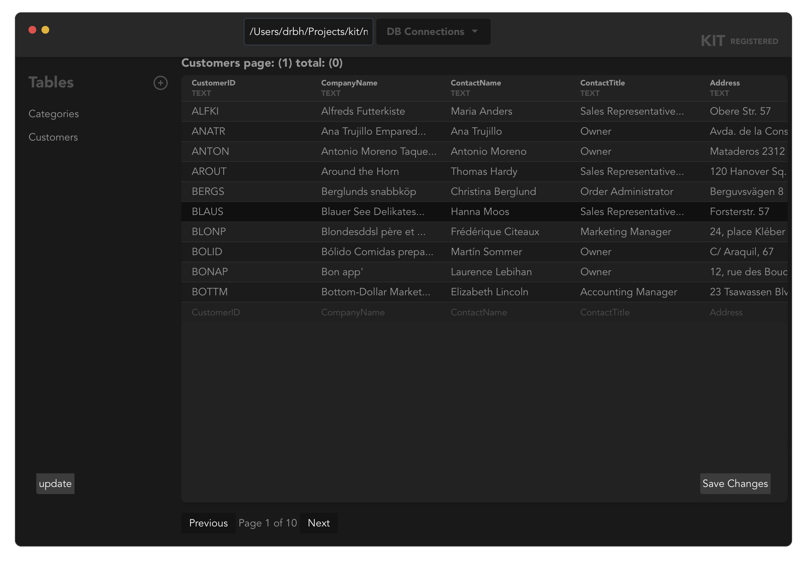

# KIT | minimal osx sqlite app

Welcome to kit, your trusted open source SQLite viewer. This robust, minimal SQLite3 client/manager is meticulously designed with a strong emphasis on privacy and transparency. 

Our codebase is open for everyone to see, except for the `src` folder, which houses our frontend Svelte app. This is a deliberate choice to ensure that all the code that interacts with your data is open source. We believe in the power of transparency and the right to privacy. 

At kit, we understand the importance of trust when it comes to handling your data. That's why we've made it our mission to build a product that not only meets your needs but also respects your privacy. 

Our commitment to open source is a testament to our dedication to creating a safe, reliable, and user-friendly SQLite viewer. We're proud of the professional-grade tool we've built and we're excited for you to experience the difference with kit.

